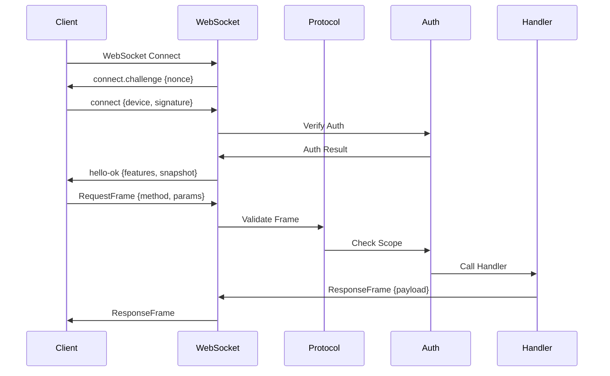
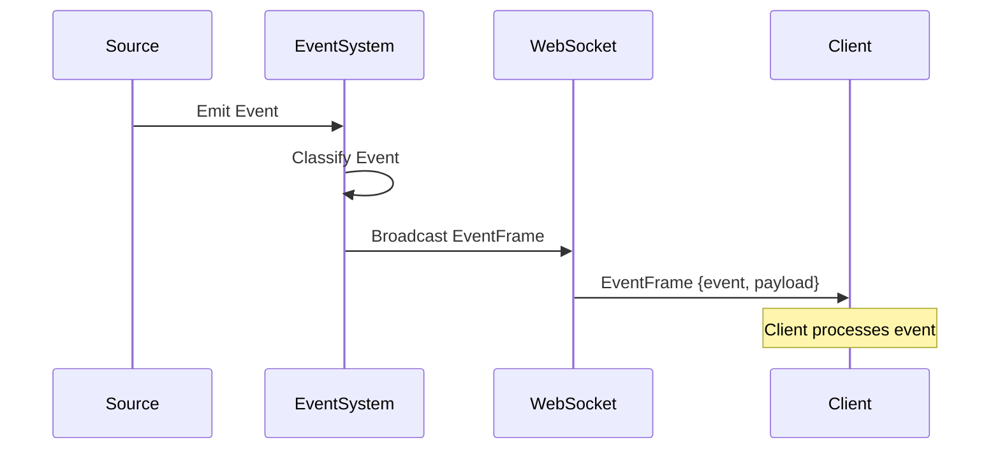

# 架构设计

> **本文档引用的源码文件**
>
> - `src/gateway/server.impl.ts` - Gateway 服务器主入口
> - `src/gateway/client.ts` - Gateway 客户端实现
> - `src/gateway/boot.ts` - 启动引导

## 目录

1. [简介](#简介)
2. [整体架构](#整体架构)
3. [核心组件](#核心组件)
4. [数据流](#数据流)
5. [设计理念](#设计理念)
6. [扩展机制](#扩展机制)

## 简介

OpenClaw Gateway 是 OpenClaw 的核心通信枢纽，采用分层架构设计：

- **传输层** - WebSocket + HTTP 双协议支持
- **协议层** - JSON-RPC 风格的消息协议
- **认证层** - 多种认证方式支持
- **业务层** - 会话、聊天、Agent 等功能模块
- **事件层** - 实时事件广播与订阅

## 整体架构

```
┌─────────────────────────────────────────────────────────────────────┐
│                        OpenClaw Gateway                              │
├─────────────────────────────────────────────────────────────────────┤
│                                                                      │
│  ┌──────────────┐    ┌──────────────┐    ┌──────────────┐          │
│  │  WebSocket   │    │    HTTP      │    │   Control    │          │
│  │   Server     │    │   Server     │    │     UI       │          │
│  │  (主通信)    │    │  (REST API)  │    │  (管理界面)  │          │
│  └──────┬───────┘    └──────┬───────┘    └──────┬───────┘          │
│         │                   │                   │                  │
│         ▼                   ▼                   ▼                  │
│  ┌─────────────────────────────────────────────────────────┐       │
│  │                    Protocol Layer                         │       │
│  │  ┌─────────────┐  ┌─────────────┐  ┌─────────────┐      │       │
│  │  │ RequestFrame│  │ResponseFrame│  │ EventFrame  │      │       │
│  │  └─────────────┘  └─────────────┘  └─────────────┘      │       │
│  │  ┌─────────────────────────────────────────────────┐    │       │
│  │  │           Validation (AJV JSON Schema)           │    │       │
│  │  └─────────────────────────────────────────────────┘    │       │
│  └─────────────────────────────────────────────────────────┘       │
│                              │                                      │
│                              ▼                                      │
│  ┌─────────────────────────────────────────────────────────┐       │
│  │                    Auth Layer                            │       │
│  │  ┌─────────┐ ┌─────────┐ ┌─────────┐ ┌─────────────┐   │       │
│  │  │  Token  │ │Password │ │ Device  │ │  Tailscale  │   │       │
│  │  │  Auth   │ │  Auth   │ │Identity │ │    Auth     │   │       │
│  │  └─────────┘ └─────────┘ └─────────┘ └─────────────┘   │       │
│  └─────────────────────────────────────────────────────────┘       │
│                              │                                      │
│                              ▼                                      │
│  ┌─────────────────────────────────────────────────────────┐       │
│  │                    Method Handlers                       │       │
│  │  ┌──────────┐ ┌──────────┐ ┌──────────┐ ┌──────────┐   │       │
│  │  │sessions.*│ │ chat.*   │ │ agents.* │ │ config.* │   │       │
│  │  └──────────┘ └──────────┘ └──────────┘ └──────────┘   │       │
│  │  ┌──────────┐ ┌──────────┐ ┌──────────┐ ┌──────────┐   │       │
│  │  │ models.* │ │ tools.*  │ │ health.* │ │  cron.*  │   │       │
│  │  └──────────┘ └──────────┘ └──────────┘ └──────────┘   │       │
│  └─────────────────────────────────────────────────────────┘       │
│                              │                                      │
│                              ▼                                      │
│  ┌─────────────────────────────────────────────────────────┐       │
│  │                    Event System                          │       │
│  │  ┌──────────┐ ┌──────────┐ ┌──────────┐ ┌──────────┐   │       │
│  │  │  agent   │ │   chat   │ │  health  │ │ presence │   │       │
│  │  │  events  │ │  events  │ │  events  │ │  events  │   │       │
│  │  └──────────┘ └──────────┘ └──────────┘ └──────────┘   │       │
│  └─────────────────────────────────────────────────────────┘       │
│                                                                      │
└─────────────────────────────────────────────────────────────────────┘
```

## 核心组件

### 1. WebSocket Server

**职责**：

- 维护持久连接
- 处理 RPC 请求
- 广播事件

**源码位置**: `src/gateway/server.impl.ts`

```typescript
// 服务器配置
type GatewayServerOptions = {
  port: number
  bind: 'loopback' | 'all'
  auth: AuthConfig
  tls?: TLSConfig
}

// 服务器状态
type GatewayServerState = {
  connections: Map<string, ClientConnection>
  methodHandlers: Map<string, MethodHandler>
  eventSubscribers: Map<string, Set<string>>
}
```

### 2. Gateway Client

**职责**：

- 建立 WebSocket 连接
- 处理认证握手
- 发送 RPC 请求
- 接收事件通知

**源码位置**: `src/gateway/client.ts`

```typescript
// 客户端状态机
type ClientState = 
  | 'disconnected'   // 未连接
  | 'connecting'     // 连接中
  | 'connected'      // 已连接（等待握手）
  | 'handshaked'     // 已握手（可正常通信）

// 客户端配置
type GatewayClientOptions = {
  url: string
  token?: string
  deviceIdentity?: DeviceIdentity
  tlsFingerprint?: string
  reconnect?: {
    enabled: boolean
    maxDelayMs: number
    initialDelayMs: number
  }
}
```

### 3. Protocol Layer

**职责**：

- 消息序列化/反序列化
- 消息验证
- 错误格式化

**源码位置**: `src/gateway/protocol/`

```typescript
// 消息帧类型
type Frame = RequestFrame | ResponseFrame | EventFrame

// 验证器
const validateRequestFrame = ajv.compile(RequestFrameSchema)
const validateResponseFrame = ajv.compile(ResponseFrameSchema)
const validateEventFrame = ajv.compile(EventFrameSchema)
```

### 4. Auth Layer

**职责**：

- 认证方式选择
- 权限验证
- Scope 检查

**源码位置**: `src/gateway/auth.ts`

```typescript
// 认证结果
type GatewayAuthResult = {
  ok: boolean
  method?: AuthMethod
  user?: string
  reason?: string
  scopes?: string[]
}

// 认证方式
type AuthMethod = 
  | 'none'
  | 'token'
  | 'password'
  | 'device-token'
  | 'bootstrap-token'
  | 'tailscale'
```

## 数据流

### 请求-响应流程



### 事件广播流程



## 设计理念

### 1. 单连接多路复用

Gateway 使用单个 WebSocket 连接处理所有通信：

- RPC 请求/响应通过 `id` 关联
- 事件通过 `event` 字段区分
- 避免频繁建立连接的开销

### 2. 事件驱动架构

所有状态变化都通过事件通知：

- Agent 生命周期事件
- 聊天消息流事件
- 系统健康状态事件
- 会话变更事件

### 3. 插件化扩展

Gateway 支持多种扩展机制：

- **Channel** - 通信渠道扩展（Zalo, LINE, Discord）
- **Skill** - 技能扩展（GitHub, Notion, Slack）
- **Hook** - 钩子扩展（Gmail, Webhook）

### 4. 安全优先

- 默认禁止明文连接（ws\://）
- 支持 TLS 指纹验证
- 认证失败速率限制
- 操作审计日志

## 扩展机制

### 添加新的 RPC 方法

```typescript
// 1. 定义方法处理器
const myMethodHandler: MethodHandler = async (params, options) => {
  // 参数验证
  // 业务逻辑
  return { result: 'ok' }
}

// 2. 注册到处理器映射
coreGatewayHandlers['my.method'] = myMethodHandler

// 3. 定义权限要求
methodScopes['my.method'] = 'operator.write'
```

### 添加新的事件类型

```typescript
// 1. 定义事件结构
type MyEventPayload = {
  field: string
  value: unknown
}

// 2. 发送事件
function emitMyEvent(payload: MyEventPayload) {
  broadcast({
    type: 'event',
    event: 'my.event',
    payload,
    seq: nextSeq()
  })
}
```

### 添加新的认证方式

```typescript
// 1. 实现认证器
const myAuthenticator: Authenticator = {
  name: 'my-auth',
  authenticate: async (params) => {
    // 验证逻辑
    return { ok: true, user: 'user' }
  }
}

// 2. 注册认证器
authenticators.push(myAuthenticator)
```

